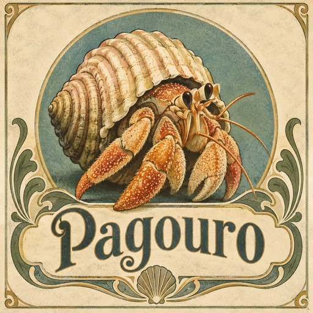

# Pagouro



> A small language model, built from scratch, that lives on a USB stick and needs nothing from
> outside.
>
> Greek *págouros*, hermit crab: carries a home it can move out of. The *ouro* nods to ouroboros —
> self-sufficient.

Pagouro is a one-billion-parameter language model on a USB stick, built to prove one thing: that an AI can be fully documented and fully self-contained and still be useful. It is not trying to be the smartest model you can run. It is trying to be the only one whose promises a stranger can check — every training byte licensed and dated, its honesty measured on a test that ships with it, finished and frozen the day it was released.

**Released 2026-09-29 — version 1.0, frozen.** Download: https://github.com/ericrwade/pagouro/releases/tag/v1.0 (zip SHA-256 `96debc3e…`) · weights and ledger: https://huggingface.co/Pagouro/pagouro-1.0 · permanent copy: https://arweave.net/6XjlZGVYmp1mDjfcwHRPpr8qe8xOpLHCAMDoB5WXGBk · manifest signed (`RWQe8tvI…`) and timestamped on Bitcoin block 968959. This repository is archived: read-only, forkable.

**How it got here (status as of the freeze, 2026-09-26):** The 1B model is trained (D-85: 8×H100, 99,724,809,408 licensed and dated tokens, 61.6 h, $1,778.97 read from the account), post-trained on the project's own seeds and GRPO against its own honesty scorer, last on a curriculum built from its own failures (D-87 → D-96), and on the stick inside the real application (`app/`). On the 100-item honesty sets (D-73), at the decode it ships with, it invents an answer to **13 %** of unanswerable questions and answers **82 %** of real ones correctly (small open models: 50–57 % and 87–93 %; frontier models: 23–27 % and 97 %; `evals/results/pagouro-1b-soup-g3-cp-4-trim2__*`, `docs/facts.json`). Tool routing 23/24; memory routed 9/10; tool-result fidelity 9/10; a four-turn conversation through the app with no repeated answer. It clears the release gate (answered-real ≥ 80 %, bluff below every open baseline) and the original stretch target (≤ 20 %). On a program-checked set of school word problems it solves 11 of 320 without tools: it is a 1B, and it points to its calculator. Three research rounds followed: the first two improved reasoning five-fold at the cost of honesty and did not ship (D-95); the third trained the shipped model on its own failures and, blended 60/40 with its parent, took the bluff rate from 22 % to 13 % (D-96). Every recipe is in the repository. What remains is release (`docs/TO_DONE.md`): sign, anchor, publish, flip public.
`docs/ORIGIN_LEDGER.md` tracks every original commitment against what exists. Read
`docs/ORIGIN.md` for where this came from.

---

## What Pagouro is

A 968,968,192-parameter model, pretrained from random weights on a fully licensed and fully documented
corpus, packaged as a portable application that runs offline on any machine. It loses to the
models you already use on every capability test — Chapter 1 of the book says so in numbers. What
it offers instead is a set of promises a stranger can check (`docs/WHY.md`, D-83):

- **Licensed.** Every training byte has a licence you can name and a row in `corpus.json`: source,
  licence, date basis, token count, and the hash of the processed slice. When the rights were
  unclear, the answer was no, and the ledger records what was removed and why.
- **Dated.** Everything it read was written or collected before 1 January 2022, and the date basis
  is on every row — the last corpus anyone will build that can make the claim at all.
- **Honest, measured.** The headline number is how often it invents an answer to a question that
  has none, on a test frozen before the model existed, with the answered-real rate printed beside
  it. The test ships; run it on the big models too. It will never say "does not hallucinate".
- **Finished.** Released once, frozen, signed, its hash anchored, mirrored. No account, no update
  check, no telemetry; nothing you type leaves the machine, and `docs/THREAT_MODEL.md` says exactly
  what "private" means and where it stops — it governs what this README is allowed to claim.
- **Your words are yours.** No watermark in what it writes for you (the program that produces every
  word is on the stick; read it), no way to add one later without breaking the manifest, and the
  project claims no rights in its outputs.

"1B" means the number of weights in the file, never more; there is no "1B+". `docs/CHECK_YOUR_COPY.md`
is the walkthrough for confirming that a stick is a real, unmodified Pagouro, written for someone
who has never heard of a hash.

## Read these first

| File | What it is |
|---|---|
| `START_HERE.md` | Session opener and current state |
| `docs/DECISIONS.md` | **Highest authority.** Every locked decision, with reasons |
| `PAGOURO_BRIEF.md` | Origin document. Partly superseded; carries a precedence notice |
| `docs/THREAT_MODEL.md` | Binding on every privacy claim |
| `docs/MILESTONES.md` | The nine milestones and their acceptance criteria |
| `ENVIRONMENT.md` | Hardware findings and measured baselines |

## The 1B, measured

| | |
|---|---|
| Model | 968,968,192 parameters; 20 layers, dim 2048, 16 heads / 4 KV heads, FFN 5,632; context 8,192 |
| Corpus | 99,724,809,408 tokens: FineWeb-Edu (ODC-By, dumps ≤ 2021-49) 91.6 %, Stack Exchange (CC BY-SA) 7.7 %, dated code 0.7 % (×3); anneal on a licensed 31-work shelf |
| Training | 95,104 steps on 8× H100 SXM, 2026-09-22 → 09-24, 460k tokens/s; warmup-stable-decay; anneal held-out perplexity 10.78 → 9.2 |
| Post-training | SFT on the project's own seeds; GRPO ×4 against `evals/run_eval.py`'s scorer, the last on a curriculum of the model's own failures, blended 60/40 with its parent (D-96); decode settled by measurement (greedy, no repetition penalty, loop trim — D-93) |
| Honesty (100-sets) | bluff **13 %** / hedge 3 % / abstain 84 % on the unanswerable set; **82 %** correct / 8 wrong / 10 abstain on the real set |
| Files | `pagouro-q8_0.gguf` 1,102,230,720 B (the one the app runs), `pagouro-q4_k_m.gguf` 633,976,000 B; hashes in `MANIFEST.md` |
| Bill | $1,778.97 for the run; ≈ $1,915 all-in with the research rounds |

The 12.6M-parameter shakedown that proved the pipeline (architecture converts, export faithful to
the character, resume works, ledger refuses unlicensed sources) is in `BUILD_LOG.md` Day 1 and
`docs/MILESTONES.md`.

## Running it

**From the stick or the release zip:** open the folder and double-click `PAGOURO.bat` (or run
`pagouro.exe`). Nothing to install; no internet needed; the first start from a USB stick reads a
1 GB file and can take a minute — it says so while loading. Measured on an Intel N100 laptop (800 MHz,
16 GB): about a minute to start, 10–20 seconds to the first answer. To check your copy without
installing anything, double-click `VERIFY.bat` (Windows PowerShell); with Python, `python verify_manifest.py`. `/help` lists the commands; `/careful`
re-asks each question five times and calls disagreement a guess. `pagouro.exe --serve` exposes the
same harness as a local OpenAI-compatible endpoint for agent frameworks (`agents/README.md`).

**Release signing key (minisign):** `RWQe8tvI6RCE2uMbuILC9/rEr6bNZdcOA+WC7dHtObLE94ovGk8xuFlG` — `pagouro.pub` in this repository and on the stick; `MANIFEST.md.minisig` is verified with `minisign -Vm MANIFEST.md -P RWQe8tvI6RCE2uMbuILC9/rEr6bNZdcOA+WC7dHtObLE94ovGk8xuFlG`.

*Windows SmartScreen:* the executable is not code-signed (signing costs money and would change the
bytes the manifest anchors). Windows may show "Windows protected your PC" — click **More info →
Run anyway**. The manifest, its signature and the Bitcoin timestamp are what vouch for the file;
`docs/CHECK_YOUR_COPY.md` walks through checking them.

**Building it yourself** (Python 3.12, ~1 GB of disk for the small model; no GPU needed for the
pipeline, a rented card for the 1B — `docs/MAKE_IT_YOURS.md` and the book's do-it chapters):

```bash
python -m venv .venv
.venv/Scripts/python.exe -m pip install torch --index-url https://download.pytorch.org/whl/cpu
.venv/Scripts/python.exe -m pip install numpy tokenizers datasets huggingface-hub tqdm gguf

bash tools/fetch_llamacpp.sh              # pinned llama.cpp build, not committed

.venv/Scripts/python.exe scripts/fetch_data.py --docs 20000
.venv/Scripts/python.exe scripts/train_tokenizer.py --vocab-size 8192
.venv/Scripts/python.exe scripts/tokenize_corpus.py
.venv/Scripts/python.exe scripts/train.py --max-steps 2000
.venv/Scripts/python.exe scripts/export_gguf.py
.venv/Scripts/python.exe scripts/verify_gguf.py          # must print PASS
```

`scripts/train.py --resume` continues from the latest checkpoint. The 1B run itself is
`scripts/runpod/train_1b.sh` (`docs/JOB_1B.md`); the evaluation chain is `scripts/eval_gguf.sh`.

**Benchmark on an idle machine.** Mining on this box made training measure 30x slow and looked
exactly like a broken toolchain. See `ENVIRONMENT.md`, Finding 6.

## Layout

```
pagouro/model.py        the transformer
scripts/fetch_data.py   corpus download + ledger row (refuses unlicensed sources)
scripts/train_tokenizer.py
scripts/tokenize_corpus.py
scripts/train.py        training, checkpoint, resume, loss log
scripts/export_gguf.py  GGUF writer (own code; the converter upstream moves between releases)
scripts/verify_gguf.py  proves llama.cpp agrees with PyTorch
corpus.json             the provenance ledger
```

`data/`, `checkpoints/`, `runs/` and `tools/llamacpp/` are generated and not committed.

This was built by one person and cost about $1,900 in rented compute. It is finished and free. If it is useful to you: fork it, or send a small sponsorship toward what it cost — https://github.com/sponsors/ericrwade.

## Licence

Weights **CC BY-SA 4.0**, code **Apache 2.0** (D-31, 2026-09-16: share-alike sources are in the
corpus and the weights say so). The book: story chapters all rights reserved, do-it chapters
CC BY-SA 4.0 (D-64).

---

*Hermit crab: carries a home it can leave. Ouroboros: needs nothing from outside. Both are the
product.*

---

*This is a personal project which has been built as free and open-source software and has no connection to myself after launch, nor to my employer at any time.* — Eric Wade
